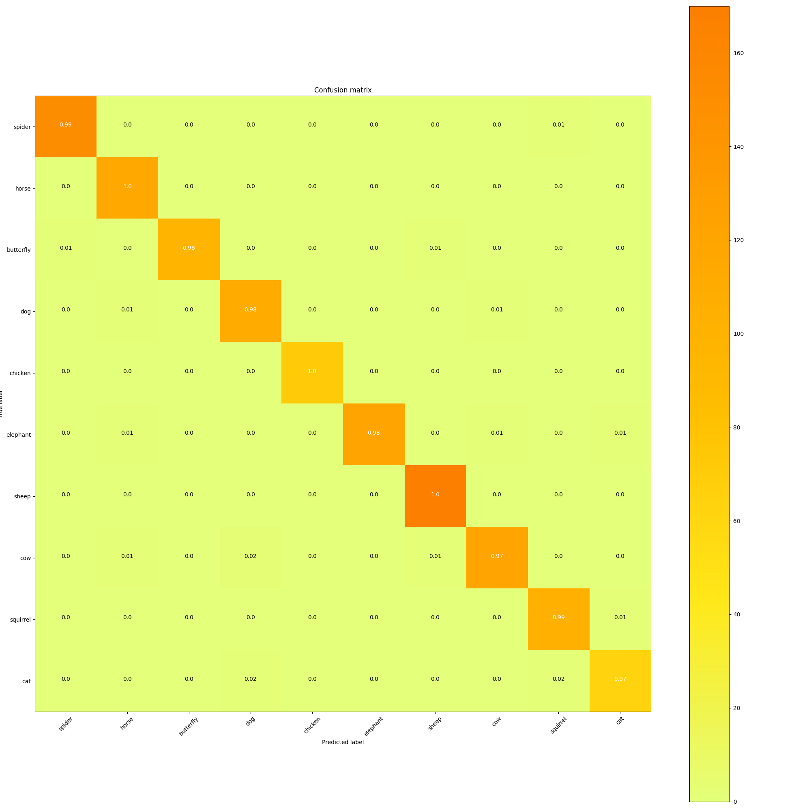

# [PYTORCH] Animals Classification

## Introduction

Here is my pytorch implementation of the EfficientNet-B0 model applied to an animal classification task with 10 classes using transfer learning.
 
## How to use my code

With my code, you can:
* **Train your model from scratch**
* **Train your model with my trained model**
* **Evaluate test images/videos with either my trained model or yours**

## Requirements:

* **python 3.11**
* **pytorch 2.4**
* **opencv (cv2)**
* **tensorboard**
* **tensorboardX** (This library could be skipped if you do not use SummaryWriter)
* **torchvision**
* **PIL**
* **numpy**
* **tqdm**
* **sklearn**

## Datasets:

Statistics of datasets I used for experiments. These datasets could be download from [link](https://www.kaggle.com/datasets/alessiocorrado99/animals10)

| Dataset                   | #Classes | #Train images | #Validation images |
|---------------------------|:--------:|:-------------:|:------------------:|
| Animals-10                |    10    |      25041    |        1138        |

Create a data folder under the repository,

```
cd {repo_root}
mkdir data
```

Make sure to put the files as the following structure:
  ```
  Animals-10
  ├── train
  │   ├── butterfly  
  │   ├── cat
  │   ├── chicken
  │   ├── cow
  │   ├── dog
  │   ├── elephant
  │   ├── horse
  │   ├── sheep
  │   ├── spider
  │   └── squirrel
  ├── test
  │   ├── butterfly  
  │   ├── cat
  │   ├── chicken
  │   ├── cow
  │   ├── dog
  │   ├── elephant
  │   ├── horse
  │   ├── sheep
  │   ├── spider
  │   └── squirrel
  ```
## Setting:

* **Model structure**: I used the EfficientNet-B0 model with pretrained weights on the ImageNet-1K
* **Data augmentation**: I only resized images to the standard size of 224x224 pixels for input.
* **Loss**: I used the CrossEntropyLoss as my loss function
* **Optimizer**: I used SGD optimizer and my learning rate schedule is 0.01

## Trained models

You could find trained model I have trained in [link](https://drive.google.com/drive/folders/1gkcMPcfBERsTAO5eEYJglK9CZZSH2ZpO?usp=sharing)

## Training

I provide my pre-trained model name **best.pt**. You could put it in the folder **trained_models/**, and load it before training your new model, for faster convergence.

If you want to train a new model, you could run:
- **python train.py --dataset_dir path/to/input/folder**: For example, python train.py --dataset_dir "Animals-10"

## Test

By default, my test script will load trained model from folder **trained_models/**. You of course could change it to other folder which contains your trained model(s).

I provide 2 different test scripts:

If you want to test a trained model with image, you could run:
- **python inference.py -i path/to/input/image**: For example, python inference.py -i images/dog.jpg

If you want to test a model with video, you could run:
- **python inference_video.py -v path/to/input/video**: For example, python inference_video.py -v images/dog.mp4. A video with prediction written on the video will be generated and save into the current folder.

## Experiments:

I trained models with GPU P100 on Kaggle for 20 epochs

The training/test loss curves for each experiment are shown below:

- **Loss**

- **Confusion Matrix**


## Results

Some output predictions for experiments are shown below:

- **Image**

     

- **Video**

  
